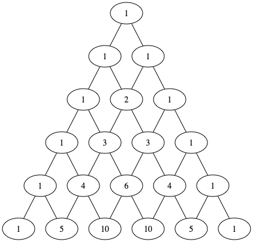

# 缘起

近期一直在使用 org mode, 不过主要是作为任务管理工具，实际上作为一个纯文本的任务管理工具，org mode 实在是特别好用了，其他的工具基本上都难以望其项背。在参考了网上很多工作流之后也逐渐形成了自己的工作流，作为一个跟踪和记录特别有意思。

前两天看到一篇论文，是讲 org mode 的，论文在[这里](https://www.jstatsoft.org/article/view/v046i03)。从文学编程（Literate Programming）和可重复性研究（Reproducible Research）两个方向探讨了一下 org mode 这个工具，当然不管是文学编程或者可重复性研究，它们依赖的工具实际上都是 org-babel。所以到这里我觉得有必要从另一个角度来看待一下 org mode 和 org-babel 了。更值得一提的是，他这篇投稿论文本身也是 org-mode 写成的。

# 文学编程

这个概念前面提过，但是实际上它是由两个部分组成的，一个叫 tangle, 一个叫 weave, 整体来讲，编程就像写文章，weave 是说生成一个和源代码对应的文档，实际上这个在 org mode 的原来的文档里面就可以做到，到处是代码的说明，比较相近是类似 sphinx 这样文档生成工具。而 tangle 就是说将文档里面的代码抽取出来进行编译并形成真正的程序。 实际上 org 源文档进行 export 就可以实现 weave 过程，而 tangle 是需要通过 org 命令来执行的。

而因为在文学编程里面，不可能把所有的代码都放在一个代码块里面，因此需要拆分成很多个部分，而这多个部分最后可以组合起来，在组合的过程中，因此需要代码的互相引用和插入。因此 org-babel 的代码块引入了 :noweb 这个关键字，将它设置位 yes 后，就可以使用代码块的引用了。基本是对代码块通过 `+NAME:codename` 命名之后，就可以通过 `<<codename>>` 将这一段代码加入到这个代码块里面。

# 可重复性研究

这个词实际上是从学术研究领域里面过来的，主要表达的意思是，在发表论文时候，论文可能由很多的代码和环境，我们要保证在这个环境以及代码下面，这个论文的结果是可重现的。这种情景还常常应用在教学上面，例如编程教学，要保证学生根据相关的指示能进行完全一致的环境搭建和代码运行。通常这种处理方式是，写一个很长的文档，一步一步告诉其他人怎么做，不涉及交互时，这样其实也没什么问题，但是涉及到交互，可能就比较麻烦了。因为环境多种多样，交互式输出的结果可能不太一样。会引起很多困扰。

后面就有了在文档中嵌入操作方式的一种做法，最成功的应该式 jupyter, 前身就是 ipython-notebook, 通过 python 代码和 markdowm 的方式将文字说明和代码放到一起，代码完成后，可以直接通过快捷键发回去运行。最早 jupyter 只支持 python, 深度学习出现之后，各种 ipython notebook 格式的教程和代码到处都是，后来 jupyter 经过发展也可以支持各种后端，包括 R, julia 等等。虽然支持了多种后端，但是好像还没看见能在一个演示里面组合多种语言的这样的环境。基本上是文档打开后，是什么环境就只能运行这个环境这个的语言。当然这个对于某个语言的教学其实不是太大的问题。一般这种情况就是用一种语言解决所有的问题。

# Org Mode

一般来说，文学编程和可重复性研究它们是两个不同领域的工具，很少有工具能将它们统一到一起，但是令人吃惊的是，在 org mode 里面它们是如此的和谐。

丰富的输出后端给 weave 提供了数不清的处理方式，而丰富的语言支持，则为 tangle 提供了各种各样互相运行和相关的结果。抛开文学编程不说，作为可重复性研究工具，则可以将多种语言和环境集成起来，从而丰富多样的完成一个结果。

用 emacs-lisp 作为中间件，利用命名，将各个代码块运行的结果保存起来，在其他代码块之间传递，可以很直接的进行接力完成同样的意见事情。最后以前面论文中的一个示例来结束这篇文章吧。

首先计算 pascal-triangle

    #+name: pascals-triangle 
    #+begin_src python :var n=5 :exports both :return pascals_triangle(5)
    def pascals_triangle(n):
        if n == 0: 
            return [[1]] 
        prev_triangle = pascals_triangle(n-1) 
        prev_row = prev_triangle[n-1] 
        this_row = map(sum, zip([0] + prev_row, prev_row + [0])) 
        return prev_triangle + [list(this_row)]
    
    return pascals_triangle(n) 
    #+end_src
    
    #+RESULTS: pascals-triangle
    | 1 |   |    |    |   |   |
    | 1 | 1 |    |    |   |   |
    | 1 | 2 |  1 |    |   |   |
    | 1 | 3 |  3 |  1 |   |   |
    | 1 | 4 |  6 |  4 | 1 |   |
    | 1 | 5 | 10 | 10 | 5 | 1 |

结果我们保存在 pascals-triangle 里面，在下一个代码块中，我们将它赋值给 pst, 然后生成 dot 的语言，并且保存在 pst-to-dot 变量中。

    #+name: pst-to-dot 
    #+begin_src python :var pst=pascals-triangle :results output :exports both
    def node(i, j):
        return '"%d_%d"' % (i+1, j+1)
    
    def edge(i1, j1, i2, j2):
        return '%s--%s;' % (node(i1, j1), node(i2,j2))
    
    def node_with_edges(i, j):
        line = '%s [label="%d"];' % (node(i, j), pst[i][j])
    
        if j > 0:
            line += edge(i-1, j-1, i, j) 
        if j < len(pst[i])-1:
            line += edge(i-1, j, i, j) 
        return line
    
    pst = [list(filter(None, row)) for row in pst]
    
    print ('\n'.join([node_with_edges(i, j) 
                      for i in range(len(pst)) 
                      for j in range(len(pst[i]))])) 
    #+end_src
    
    #+RESULTS: pst-to-dot
    
    "1_1" [label="1"];
    "2_1" [label="1"];"1_1"--"2_1";
    "2_2" [label="1"];"1_1"--"2_2";
    "3_1" [label="1"];"2_1"--"3_1";
    "3_2" [label="2"];"2_1"--"3_2";"2_2"--"3_2";
    "3_3" [label="1"];"2_2"--"3_3";
    "4_1" [label="1"];"3_1"--"4_1";
    "4_2" [label="3"];"3_1"--"4_2";"3_2"--"4_2";
    "4_3" [label="3"];"3_2"--"4_3";"3_3"--"4_3";
    "4_4" [label="1"];"3_3"--"4_4";
    "5_1" [label="1"];"4_1"--"5_1";
    "5_2" [label="4"];"4_1"--"5_2";"4_2"--"5_2";
    "5_3" [label="6"];"4_2"--"5_3";"4_3"--"5_3";
    "5_4" [label="4"];"4_3"--"5_4";"4_4"--"5_4";
    "5_5" [label="1"];"4_4"--"5_5";
    "6_1" [label="1"];"5_1"--"6_1";
    "6_2" [label="5"];"5_1"--"6_2";"5_2"--"6_2";
    "6_3" [label="10"];"5_2"--"6_3";"5_3"--"6_3";
    "6_4" [label="10"];"5_3"--"6_4";"5_4"--"6_4";
    "6_5" [label="5"];"5_4"--"6_5";"5_5"--"6_5";
    "6_6" [label="1"];"5_5"--"6_6";

我们取出 pas-to-dot 变量并赋值给 pst-vals, 然后调用 dot 画图。

    #+name: pst-to-fig 
    #+headers: :file pascals-triangle.png :cmdline -Tpng
    #+begin_src dot :var pst-vals=pst-to-dot :exports both
    graph {
    $pst-vals
    } 
    #+end_src
    
    #+RESULTS: pst-to-fig

最后就可以生成如下的图片 
